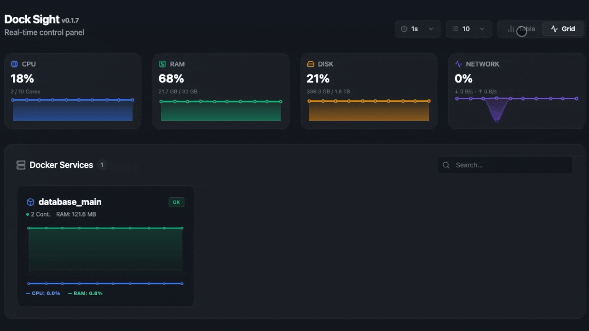

<p align="center">
  
</p>

<h1 align="center">Dock Sight</h1>

<p align="center">
  Monitor your Docker infrastructure — services, host metrics, networks and volumes — from a single, self-hosted dashboard.
</p>

<p align="center">
  <a href="https://github.com/towerforge/dock-sight/releases/latest"></a>
  <a href="https://github.com/towerforge/dock-sight/releases"></a>
  <a href="https://hub.docker.com/r/towerforge/dock-sight"></a>
  <a href="LICENSE"></a>
</p>

<br />



---

## Overview

Dock Sight runs as a single binary and serves a real-time dashboard in your browser. No agents, no external dependencies, no cloud.

| Area | What you get |
|---|---|
| **Host metrics** | CPU, RAM, disk and network usage with historical charts |
| **Docker services** | Container status, resource consumption, per-service CPU/RAM/network charts, images and live logs. Scale, pause, delete and pull latest image directly from the dashboard |
| **Networks** | Visual table of Docker networks with service distribution, health status and RX/TX rates. Create and delete networks from the dashboard |
| **Volumes** | List all Docker volumes with size, mount point, disk usage and service grouping. Create and delete volumes from the dashboard |
| **Registries** | Manage private DockerHub registries (create, list, delete) and use them when deploying new services |
| **Users** | Multi-user access — create, delete and reset passwords for any user. All users have the same privileges |
| **Security** | Brute-force protection per IP (blocked after 10 failed attempts in 15 min). Rate-limit state and login event log are persisted in SQLite and visible in Settings → Security |
| **Proxy** | Built-in reverse proxy — map domains to services, issue and auto-renew Let's Encrypt certificates (HTTP-01), or generate self-signed certs. No nginx or external dependencies required |

## Requirements

- Docker Engine (required for Docker service views)
- Linux x86_64 / ARM64 / ARMv7 / i686, or macOS Intel / Apple Silicon

## Installation

### Quick install

```bash
curl -fsSL https://raw.githubusercontent.com/towerforge/dock-sight/main/install.sh | sh
```

Detects your platform and installs to `/usr/local/bin` (root) or `~/.local/bin` (non-root).

### Manual download

Pre-built binaries are available on the [releases page](https://github.com/towerforge/dock-sight/releases/latest).

| Platform | Package |
|---|---|
| Linux x86_64 (glibc) | `dock-sight-linux-x86_64.tar.gz` |
| Linux x86_64 (static) | `dock-sight-linux-x86_64-musl.tar.gz` |
| Linux ARM64 (glibc) | `dock-sight-linux-aarch64.tar.gz` |
| Linux ARM64 (static) | `dock-sight-linux-aarch64-musl.tar.gz` |
| Linux ARMv7 | `dock-sight-linux-armv7.tar.gz` |
| Linux i686 | `dock-sight-linux-i686.tar.gz` |
| macOS Intel | `dock-sight-macos-x86_64.tar.gz` |
| macOS Apple Silicon | `dock-sight-macos-aarch64.tar.gz` |

> Use the **static** (`-musl`) variant on Alpine Linux or any system where glibc availability is uncertain.

## Usage

```
dock-sight [OPTIONS]

Options:
  -p, --port <PORT>   Port to listen on [default: 8080]
      --dev           Enable development mode (disables auth middleware, enables CORS)
  -h, --help          Print help
  -V, --version       Print version
```

Open [http://localhost:8080](http://localhost:8080) in your browser. On first launch you will be prompted to create the first user before the dashboard is accessible.

### Environment variables

| Variable | Default | Description |
|---|---|---|
| `DATA_DIR` | `.` | Directory where `dock-sight.db` is stored |
| `SESSION_DURATION_HOURS` | `24` | How many hours a login session stays valid |
| `SECURE_COOKIES` | `false` | Set to `true` to add the `Secure` flag to session cookies (recommended behind an HTTPS reverse proxy) |
| `BACKEND_PORT` | `8080` | Port override (alternative to `--port`) |

## Docker

```bash
docker run -d \
  --name dock-sight \
  --restart unless-stopped \
  --network host \
  -v /var/run/docker.sock:/var/run/docker.sock \
  -v dock-sight-data:/data \
  -e DATA_DIR=/data \
  towerforge/dock-sight:latest
```

> **`--network host` is strongly recommended.** With `-p 8080:8080` Docker's userland-proxy
> creates an internal TCP relay and the backend only ever sees `172.17.0.1` as the client address.
> `--network host` bypasses that relay so the real client IP is visible — which makes login
> event logging and brute-force rate-limiting work correctly.
> When using host networking, `-p` port mappings are not used; the app listens directly on port 8080 of the host.

The `-v dock-sight-data:/data` volume persists the SQLite database (users, registries, login history) across container recreations.

<details>
<summary>docker-compose (standalone)</summary>

```yaml
services:
  dock-sight:
    image: towerforge/dock-sight:latest
    container_name: dock-sight
    restart: unless-stopped
    network_mode: host          # required for correct client-IP logging
    volumes:
      - /var/run/docker.sock:/var/run/docker.sock
      - dock-sight-data:/data
    environment:
      - DATA_DIR=/data

volumes:
  dock-sight-data:
```

</details>

<details>
<summary>Docker Swarm stack</summary>

`network_mode: host` is not available in Swarm mode. Use `mode: host` on the port instead —
this publishes the port directly on the node, bypassing the ingress routing mesh so the real
client IP reaches the container.

```yaml
services:
  dock-sight:
    image: towerforge/dock-sight:latest
    deploy:
      replicas: 1
      placement:
        constraints:
          - node.role == manager   # needs access to the Docker socket
    ports:
      - target: 8080
        published: 8080
        protocol: tcp
        mode: host                 # bypasses ingress mesh → real client IP preserved
    volumes:
      - /var/run/docker.sock:/var/run/docker.sock
      - dock-sight-data:/data
    environment:
      - DATA_DIR=/data

volumes:
  dock-sight-data:
```

</details>

<details>
<summary>systemd (Linux)</summary>

```ini
[Unit]
Description=Dock Sight
After=network.target docker.service

[Service]
ExecStart=/usr/local/bin/dock-sight --port 8080
Environment=DATA_DIR=/etc/dock-sight
Restart=always

[Install]
WantedBy=multi-user.target
```

</details>

## Behind a reverse proxy

Dock Sight can be exposed directly on a public port, but it is strongly recommended to place a reverse proxy (nginx, Caddy, Traefik…) in front of it to handle TLS. When you do, two things must be configured for everything to work correctly:

**1. Forward the real client IP**

The brute-force protection and login event log rely on the client's IP address. When a proxy sits in front, the backend only sees `127.0.0.1` unless the proxy forwards the original IP via `X-Forwarded-For`. Without this, every failed login attempt is counted against the same address and the log becomes useless.

<details>
<summary>nginx</summary>

```nginx
location / {
    proxy_pass         http://127.0.0.1:8080;
    proxy_set_header   Host              $host;
    proxy_set_header   X-Forwarded-For   $proxy_add_x_forwarded_for;
    proxy_set_header   X-Real-IP         $remote_addr;
}
```

</details>

<details>
<summary>Caddy</summary>

```caddy
reverse_proxy 127.0.0.1:8080 {
    header_up X-Forwarded-For {remote_host}
    header_up X-Real-IP       {remote_host}
}
```

</details>

<details>
<summary>Traefik (Docker label)</summary>

Traefik passes `X-Forwarded-For` automatically when `forwardedHeaders` is enabled. Add this to your static config:

```yaml
entryPoints:
  web:
    forwardedHeaders:
      insecure: true   # or restrict to trusted CIDRs with `trustedIPs`
```

</details>

**2. Enable secure cookies**

Set the `SECURE_COOKIES=true` environment variable so that session cookies are flagged as `Secure` and are only sent over HTTPS:

```bash
-e SECURE_COOKIES=true
```

## Data persistence

All state is stored in a single SQLite database (`dock-sight.db`) in `DATA_DIR`:

| Table | Contents |
|---|---|
| `users` | Usernames and hashed passwords |
| `registries` | DockerHub registry credentials |
| `login_attempts` | Active rate-limit counters per IP |
| `login_events` | Login attempt history (last 50 shown in Settings → Security) |

## Proxy

Dock Sight includes a built-in reverse proxy that runs natively alongside the dashboard — no nginx, Caddy or external process required. It is implemented entirely in Rust using `hyper` + `rustls` and managed from a dedicated **Proxy** section in the UI.

### How it works

The proxy engine starts two listeners inside the same binary:

- **Port 80** — HTTP, used for Let's Encrypt HTTP-01 challenge responses and optional redirect to HTTPS
- **Port 443** — HTTPS, TLS-terminated with the certificates managed by dock-sight

Incoming requests are routed by the `Host` header to the configured target URL. Configuration is read from SQLite at runtime — adding or updating a host takes effect immediately without restarting the service.

### Adding a proxy host

1. Open the **Proxy** section in the sidebar
2. Click **Add Proxy Host**
3. Fill in the domain (`app.example.com`), the target URL (`http://localhost:3000`) and choose an SSL mode
4. Save — the host is active immediately

### SSL modes

| Mode | Description |
|---|---|
| **None** | Plain HTTP only, no TLS |
| **Let's Encrypt** | Automatically issues and renews a certificate via ACME HTTP-01. Port 80 must be reachable from the internet |
| **Self-signed** | Generates a local certificate with `rcgen`. Useful for internal services or testing |

### Auto-renewal

When Let's Encrypt is selected, dock-sight checks certificate expiry in the background and renews automatically 7 days before expiration. The current expiry date and renewal status are visible inline in the proxy host list.

### Environment variables

| Variable | Default | Description |
|---|---|---|
| `PROXY_HTTP_PORT` | `80` | Port the proxy listens on for HTTP traffic |
| `PROXY_HTTPS_PORT` | `443` | Port the proxy listens on for HTTPS traffic |
| `ACME_EMAIL` | — | Contact email sent to Let's Encrypt during certificate issuance (required when using Let's Encrypt mode) |

### Data persistence

Proxy configuration and certificates are stored in the same SQLite database as the rest of dock-sight:

| Table | Contents |
|---|---|
| `proxy_hosts` | Domain, target URL, SSL mode, force-HTTPS flag, enabled state |
| `ssl_certificates` | PEM certificate and key, expiry date, last renewal timestamp |

### Scope and limitations

- One target URL per host (no load balancing)
- HTTP-01 challenge only — DNS-01 and wildcard certificates are not supported
- Port 80 must be accessible from the internet for Let's Encrypt to work

---

## Service grouping

Containers are grouped by the `com.docker.swarm.service.name` label. Containers without this label appear under `standalone`.

## License

MIT — see [LICENSE](LICENSE).
